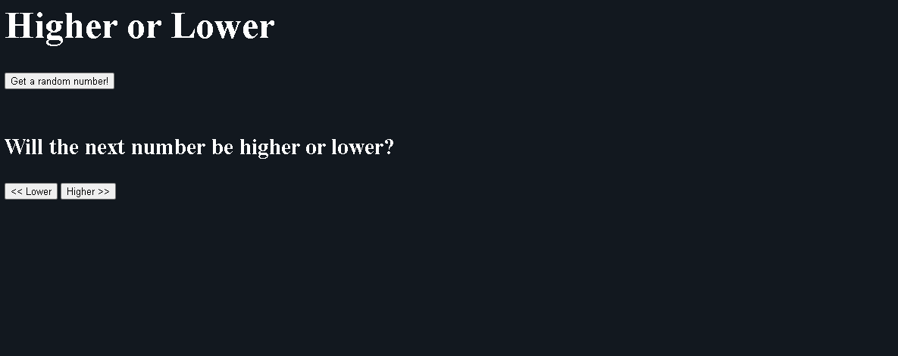

# Higher or Lower Game

## Introduction

In this project, you will create a small game where a random number will be generated at the click of a button and you as the player will decide whether the next number will be higher or lower.


## Table of Contents

- [Introduction](#introduction)
- [Step-by-Step Guide](#step-by-step-guide)
  - [1. Take a look at the HTML](#1-take-a-look-at-the-html)
  - [2. JavaScript](#2-javascript)
  - [3. Higher Function](#3-higher-function)
  - [4. Lower Function](#4-lower-function)
  - [5. Center The Game With CSS](#5-center-the-game-with-css)
- [Stretch Goals](#stretch-goals)
- [Conclusion](#conclusion)

## Step-by-Step Guide

### 1. Take a look at the HTML

Open `index.html` in your code editor and preview it. It should look like this:



Our HTML has three buttons in it, which are how we'll make use of our JavaScript to play the game! Looking at the HTML, the three button elements are...

```
<button type="button" onclick="generateRandom()">Get a random number! </button>
...
<button type="button" onclick="lower()"><< Lower</button>
<button type="button" onclick="higher()">Higher >></button>
```

Looking at the ```onclick``` property, pressing the "Get a random number!" button will activate the generateRandom() function in JavaScript. The other buttons will activate the higher() and lower() functions as well. Let's go check out our JavaScript to see what these functions do.

### 2. JavaScript

In our JavaScript, there are two bunches of code already in place for us. Let's break down what we have so far:

```
// Global variables
var resultParagraph = document.getElementById("result");
var random;
var nextRandom = Math.floor(Math.random() * range + 1);
var range = 100;
```

- ```resultParagraph``` is a variable that helps update our HTML page with the number, don't worry about this for now.
- ```random``` is the current random number that the player sees.
- ```nextRandom``` is the upcoming next random number that the player must guess.
- ```range``` is the range of numbers the random number could be. The random number is between 0 and the range number.

What about the functions below?

```
function generateRandom() {
    random = nextRandom;
    nextRandom = Math.floor(Math.random() * range + 1);
    console.log(random);
    resultParagraph.innerHTML = random;
}
```

- This function moves the current random number to the next one, and generates a new random number for the ```nextRandom```. Running ```generateRandom()``` makes a new number to guess.
- It also updates the number on the screen.

```
function higher() {

}

function lower() {

}
```

Looks like it's up to us to program these in!

### 3. Higher Function

In a game of higher or lower, the player sees a number and needs to guess if the next random number will be higher or lower. The higher function should tell the player that they won if the ```nextRandom``` number is higher than the current ```random``` number. This calls for an ```if``` statement!

> [!TIP]
> Take a look at this if statement block. Use this to compare the current ```random``` number and the ```nextRandom``` number.
```
if (10 > 20) {
  window.alert("10 is bigger!");
}
else if (10 < 20) {
  window.alert("20 is bigger!");
}
else {
  window.alert("They are the same!");
}
```

Once you've finished writing your higher function, test your game! If the window alerts don't show up in the side preview, try opening the preview in a new window and test it there.

At the end of your higher function, make sure to use ```generateRandom()``` to make a new number to keep the game fresh!

### 4. Lower Function

This button should be very similar to the higher button, except the player is guessing that the ```nextRandom``` number is lower instead. You'll want to use more ```if``` and ```else``` statements for this one too!

Don't forget to call ```generateRandom()``` at the end of the function, or the player won't be able to get more numbers to play with!


### 5. Center The Game With CSS

Check out the ```style.css``` file, it's already linked to the HTML but it's partially incomplete! Use what you know from Flexbox to center everything! When it's centered it should look like this:


## Stretch Goals
- Make the alert say what the next number was, alongside if the player won or lost
- Keep track of the player's score and show it either in the HTML or in the alerts.
- Let the player change the range of the random numbers.

## Conclusion

Congratulations! Your higher or lower game is complete!